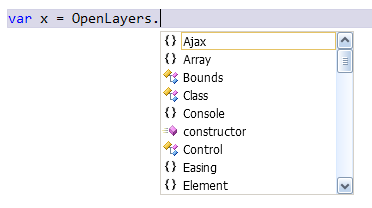

OpenLayers - Visual Studio IntelliSense
=====================

**OpenLayers - Visual Studio IntelliSense** is a fork of the [OpenLayers](http://github.com/openlayers/openlayers)
project that contains **vsdoc** files with IntelliSense documentation of the OpenLayers library.

This project uses the [jsdoc-toolkit-vsdoc](http://code.google.com/p/jsdoc-toolkit-vsdoc/)
to generate Visual Studio IntelliSense files in the **vsdoc** format.

